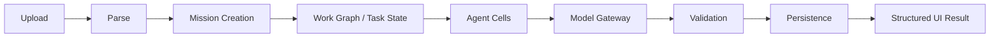

# Resume/JD Intelligence Workflow

In the current slice, the analysis cell is a bounded local service and the Model Gateway stage is not configured. Parse failures stop before analysis. Validation failures stop completion. The API returns safe error codes instead of stack traces.
